#GCSE Controlled Assessment 2 - Game Application

 - Candidate Name: Edward Digby,  
 - Candidate Number: 6035  
 - Centre Name: Bourne Grammar School,  
 - Centre Number: 26202  

The task of this controlled assessment was to produce a simple word game that displays a table of words for 30 seconds, then removes the word and displays another table without the removed word. The user then has to guess which word was removed and which was substituted in.

##User Needs
When a user opens my Memory Game, they will greeted by a menu which gives the user the option to play an easy a hard game or exit. If the easy game option is selected the user will see a 3x3 grid containing nine five-letter words. This is displayed for 30 seconds then it gets replaced with another 3x3 grid with one word having been changed. The user then needs to input the word that was removed and they have three chances to get it right. If they enter it incorrectly 3 times the games ends and they get shown an appropriate fail message. 

If they enter it correctly they get shown a success message and then they need to answer the word that was substituted in. Again they get given three chances to enter the right word and if they enter it incorrectly 3 times the game ends and they get shown an appropriate fail message. If they get it right they then get shown a success message then move onto another grid.

If they selected the hard game they will see a 4x4 grid containing 16 five-letter words. This will be displayed for longer than 30s because its harder than the easy game. Then the original grid gets replaced by another grid with one word having been replaced. The user then needs to input the word that was removed and they have three chances to get it right. If they enter it incorrectly 3 times the games ends and they get shown an appropriate fail message. 

If they enter it correctly they get shown a success message and then they need to answer the word that was substituted in. Again they get given three chances to enter the right word and if they enter it incorrectly 3 times the game ends and they get shown an appropriate fail message. If they get it right they then get shown a success message then move onto another grid.

If they selected exit the program will close.


####Flow Chart
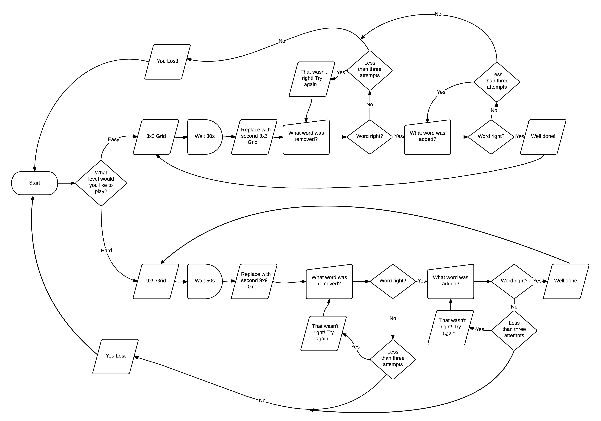

\newpage

##Full Psuedocode:
```
#Import Modules
IMPORT LIBARIES random, time, math

#Define Menu
FUNCTION menu()
	choice <-- "NULL"
	OUTPUT("""Main Menu
			Please choose a difficulty level
			Enter exit to exit the program
			A) Easy
			B) Hard
	   """)

	  WHILE choice != "A" OR choice != "B" or CHOICE != "EXIT"
	  	OUTPUT "Please choose and option:"
	  	choice <-- USERINPUT
	  	choice <-- UPPER(choice)
	  	IF choice = "A" THEN
	  		#Run the run function with the parameter 9 (the total number of words needed)
	  		run(9)
	  	ELSEIF choice = "B" THEN
	  		#Run the run function with the parameter 16 (the total number of words needed)
	  		run(16)
	  	ELSEIF choice = "EXIT" THEN
	  		EXIT
	  	ELSE
	  		OUTPUT choice " is not recognized"
	  		OUTPUT "Please try again"
	  		choice <-- "NULL"
	  	ENDIF
	  ENDWHILE
ENDFUNCTION

#Define read words function
FUNCTION readwords(level)
	#Set the path to the square root of the level + x = square root of the level + .txt. E.g. 3x3.txt
	path <-- STR(INT(SQRT(level))) + "x" +  STR(INT(SQRT(level))) + ".txt"
	#Set words to empty array to put the words in
	words <-- []
	TRY
		#Opening file using with
		WITH f <-- READFILE(path)
			#Adding each word to the array words - using python inbuilt function readfile
			words <-- words + READLINES(f)
		#For each element of the array strip it from a newline using
		
		FOR i<--1 TO LENGTH(words)
			words[i] = STRIP(words[i])
		RETURN words
	EXCEPT
		OUTPUT "I'm sorry there has been an error"
ENDFUNCTION

#Define checkifused function
FUNCTION checkifused(numsused, newnum)
	#If the array numsused is empty
	IF NOT numsused THEN
		RETURN True
	ENDIF
	#If newnum is in array
	FOR i<--1 TO LENGTH(numsused)
		IF newnum = numsused[i] THEN
			RETURN False
	ENDFOR
	#If the newnum isn't in the array
		RETURN True
ENDFUNCTION

#Define the grabwords function
FUNCTION grabwords(words, level)
	#Define the arryas toprint and numsused
	toprint <-- []
	numsused <-- []
	#For every number between 0 and the level (total words needed)
	FOR i<--1 TO level
		newnums <-- True
		WHILE newnum = True
			#Set x to a random number between 0 and the level
			x <-- RANDOM NUMBER BETWEEN 0 AND LENGTH(words)
			notused <-- checkifused(numsused, x)
			#Check If the number has been used
			IF notused = True THEN
			#Append x onto the end of the array
				numsused[LENGTH(numsused) <-- x
				newnum <-- False
			ELSE
				newnum <-- True
	ENDFOR
	#For every number in numsused add the equivelent words to the array to print
	FOR i<--1 TO LENGTH(numsused)
		toprint[LENGTH(toprint)] <-- words[numsused[i]]
	ENDFOR

	#Find a random number between 0 and the total elements in the array nums used
	toremove <-- RANDOM NUMBER BETWEEN 0 AND LENGTH(numsused)

	#For each number between 0 and the level
	FOR i<--1 TO LENGTH(level)
		#If it is in the array pass
		IF i in numsused THEN
			PASS
		#Else set the variable toadd to the word that isn't getting printed
		ELSE
			toadd <-- words[i]
	ENDIF

	#Return the array to print and the variables toremove and toadd
	RETURN toprint, toremove, toadd
ENDFUNCTION

#Define the print grid function
FUNCTION printgrid(toprint, level)
	#Set the variable count to 0
	count <-- 0
	FOR i<--1 TO toprint
		#If count is devisible by the sqaure root of the level print a new line
		IF count % SQRT(level) = 0 THEN
			OUTPUT "<<newline>>"
		ENDIF
		OUTPUT toprint[i]
		OUTPUT "   |    "
		count <-- count + 1
	ENDFOR
	OUTPUT "<<newline>>"
	RETURN
ENDFUNCTION

#Define the run function
FUNCTION run(level)
	#Read the words from the file
	words <-- readwords(level)
	#Find the words to print
	finalwords, toremove, toadd <-- grabwords(words, level)	
	#Print the first grid
	printgrid(finalwords, level)	
	#If hard level sleep for 1 min
	IF level = 16 THEN
		SLEEP(60)
	ELSE
		#If on easy level sleep for 30 seconds
		SLEEP(30)
	ENDIF
	#Clear the screen
	OUTPUT chr(27) + "[2J"
	#Set the variable removed to the word to remove
	removed <-- finalwords[toremove]
	#Replace the word that is to be removed
	finalwords[toremove] <-- toadd
	#Shuffle the array
	SHUFFLE(finalwords)
	#Print the second grid
	printgrid(finalwords, level)
	#Ask the questions
	askquestions(removed, toadd, level)
ENDFUNCTION

#Define the askquestions functione
FUNCTION askquestions(removed, added, level)
	#Define the variables wrong and attempt
	wrong <-- True
	attempt <-- 0
	#Start a while loop for while they don't have the right answer
	WHILE wrong = True
		#Ask the user to enter the word that was removed
		OUTPUT "What word was removed?"
		askremoved <-- USERINPUT
		#Check if it is the right word
		IF UPPER(askremoved) = removed THEN
			OUTPUT "You got it right!"
			#Exit the while loop
			wrong <-- False
		ELSE
			#Add 1 to the number of attempts
			attempt <-- attempt + 1
			#If they have had 3 attempts restart the game
			IF attempt = 3 THEN
				OUTPUT "You Lost!"
				menu()
			ELSE
				#Ask them to try again
				OUTPUT "Try Again"
				wrong <-- True
			ENDIF
		ENDIF
	ENDWHILE

	wrong <-- True
	#Start a while loop for while they don't have the right answer
	WHILE wrong = True
		#Ask the user to enter the word that was added
		OUTPUT "What word was added?"
		askremoved <-- USERINPUT
		#Check if the word is right
		IF UPPER(askremoved) = added THEN
			OUTPUT "You got both right!"
			wrong <-- False
			asking <-- True
			#While they haven't entered an option
			WHILE asking = True
				#Ask them if they would like to play again
				OUTPUT "Play again? [Yes/No]"
				playagain <-- USERINPUT
				#Check what option they chose
				IF UPPER(playagain) = "YES" THEN
					asking <-- False
					#Run the game again
					run(level)
				ELSEIF UPPER(playagain) = "NO" THEN
					asking <-- False
					#Exit the game
					exit()
				ELSE
					OUTPUT "Please try again"
					asking <-- True
				ENDIF
		ELSE
			#Add one to the number of attemptsf
			attempt <-- attempt + 1
			IF attempt = 3 THEN
				OUTPUT "You Lost!"
				menu()
			ELSE
				OUTPUT "Try Again"
				wrong <-- True
			ENDIF
		ENDIF
	ENDWHILE
ENDFUNCTION
menu()
```

##Tasks

###Load Words - Task 1
####Explanation
This functions opens the text file which contains all the 10 five letter words to be used later on in the program. The program gets the file name from the square root of the total number of words needed for the grid. It then opens the file and makes an array with each word in the file being an item. Then the array gets stripped from the new lines and passed back to the main run function.

####PsudeoCode

```
#Define read words function
FUNCTION readwords(level)
	#Set the path to the square root of the level + x = square root of the level + .txt. E.g. 3x3.txt
	path <-- STR(INT(SQRT(level))) + "x" +  STR(INT(SQRT(level))) + ".txt"
	#Set words to empty array to put the words in
	words <-- []
	TRY
		#Opening file using with
		WITH f <-- READFILE(path)
			#Adding each word to the array words - using python inbuilt function readfile
			words <-- words + READLINES(f)
		#For each element of the array strip it from the newline character
		FOR i<--1 TO LENGTH(words)
			words[i] = STRIP(words[i])
		RETURN words
	EXCEPT
		OUTPUT "I'm sorry there has been an error"
ENDFUNCTION
```
####Python
```python
#Define read words function
def readwords(level):
	#Set the path to the square root of the level + x = square root of the level + .txt. E.g. 3x3.txt
	path = str(int(math.sqrt(level))) +  "x" + str(int(math.sqrt(level))) + ".txt"
	#Set words to empty array to put the words in
	words = []
	try:
		#Opening file using with
		with open(path) as f:
			#Adding each word to the array words
			words += f.readlines()
		
		#If there arent enough words from the file show an error
		if len(words) < level + 1:
			exit()

		#For each element of the array strip it from newline
		for i in range(0,len(words)):
			words[i] = words[i].rstrip()
		return words
	except:
		print("I'm sorry there has been an error; the word files are invalid")
		exit()
```

###Display First Grid - Task 2
####Explanation
This task needed me to develop a way to print the 9 words in a grid formation. Each word had to be randomly placed each time. It also had to set a word to be substituted - this was the only word that wasn't printed, and then randomly select a word to remove.

####PsudeoCode

```
#Define the print grid function
FUNCTION printgrid(toprint, level)
	#Set the variable count to 0
	count <-- 0
	FOR i<--1 TO toprint
		#If count is devisible by the sqaure root of the level print a new line
		IF count % SQRT(level) = 0 THEN  
			OUTPUT "<<newline>>" 
		ENDIF
		OUTPUT toprint[i]
		OUTPUT "   |    "
		count <-- count + 1
	ENDFOR
	OUTPUT "<<newline>>"
	RETURN
ENDFUNCTION

#Define the grabwords function
FUNCTION grabwords(words, level)
	#Define the arryas toprint and numsused
	toprint <-- []
	numsused <-- []
	#For every number between 0 and the level (total words needed)
	FOR i<--1 TO level
		newnums <-- True
		WHILE newnum = True
			#Set x to a random number between 0 and the level
			x <-- RANDOM NUMBER BETWEEN 0 AND LENGTH(words)
			notused <-- checkifused(numsused, x)
			#Check If the number has been used
			IF notused = True THEN
			#Append x onto the end of the array
				numsused[LENGTH(numsused) <-- x
				newnum <-- False
			ELSE
				newnum <-- True
	ENDFOR
	#For every number in numsused add the equivelent words to the array to print
	FOR i<--1 TO LENGTH(numsused)
		toprint[LENGTH(toprint)] <-- words[numsused[i]]
	ENDFOR

	#Find a random number between 0 and the total elements in the array nums used
	toremove <-- RANDOM NUMBER BETWEEN 0 AND LENGTH(numsused)

	#For each number between 0 and the level
	FOR i<--1 TO LENGTH(level)
		#If it is in the array pass
		IF i in numsused THEN
			PASS
		#Else set the variable toadd to the word that isn't getting printed
		ELSE
			toadd <-- words[i]
	ENDIF

	#Return the array to print and the variables toremove and toadd
	RETURN toprint, toremove, toadd
ENDFUNCTION

```
####Python
```python
#Define the print grid function
def printgrid(toprint, level):
	#Set the variable count to o0
	count = 0
	#For every word in the array to print
	for i in toprint:
		#If count is devisible by the sqaure root of the level print a new line
		if count % (math.sqrt(level)) == 0:
			print("<<newline>>", end="")
		print(i, end="")
		print("   |    ", end="")
		count += 1
	print("<<newline>>")
	return

#Define the grabwords function
def grabwords(words, level):
	#Define the arryas toprint and numsused
	toprint = []
	numsused = []
	#For every number between 0 and the level (total words needed)
	for i in range(0, level):
		newnum = True
		while newnum == True:
			#Set x to a random number between 0 and the level
			x = random.randrange(0, len(words))
			#Check If the number has been used
			if numsused.count(x) == 0:
				numsused.append(x)
				newnum = False
			else:	
				newnum = True
	#For every number in numsused add the equivelent words to the array to print
	for i in numsused:
		toprint.append(words[i])

	#Find a random number between 0 and the total elements in the array nums used
	toremove = random.randrange(0, len(numsused))

	#For each number between 0 and the level
	for i in range(0, level):
		#If it is in the array pass
		if i in numsused:
			pass
		#Else set the variable toadd to the word that isn't getting printed
		else:
			toadd = words[i]
	#Return the array to print and the variables toremove and toadd
	return toprint, toremove, toadd
```
###Display Second Grid - Task 3
####Explanation
This task needed to remove the first grid, wait for 30 seconds and then print the next grid. The second grid will not have the word the was selected to be removed and will have replaced it with the word chosen to substituted in the last function.

####PsudeoCode

```
#If hard level sleep for 1 min
IF level = 16 THEN
	SLEEP(60)
ELSE
	#If on easy level sleep for 30 seconds
	SLEEP(30)
ENDIF
#Clear the screen
OUTPUT chr(27) + "[2J"
#Set the variable removed to the word to remove
removed <-- finalwords[toremove]
#Replace the word that is to be removed
finalwords[toremove] <-- toadd
#Shuffle the array
SHUFFLE(finalwords)
#Print the second grid
printgrid(finalwords, level)
```
####Python
```python
#Sleep for 30 or 60 seconds
if level == 16:
	time.sleep(60)
else:
	time.sleep(30)
#Clear the screen
print(chr(27) + "[2J")
#Set the variable removed to the word to remove
removed = finalwords[toremove]
#Replace the word that is to be removed
finalwords[toremove] = toadd
#Shuffle the array
random.shuffle(finalwords)
#Print the second grid
printgrid(finalwords, level)
#Ask the questions
askquestions(removed, toadd, level)
```
###Enter Removed Word- Task 4
####Explanation
This task needed to allow the user to enter the word they thought was removed. If they got the correct word they get shown a success message and  they will move onto the next question about the word that was substituted in. However if they get it wrong they get shown a message telling them that have got it wrong.

####PsudeoCode

```
#Define the askquestions functions
FUNCTION askquestions(removed, added, level)
	#Define the variables wrong and attempt
	wrong <-- True
	attempt <-- 0
	#Start a while loop for while they don't have the right answer
	WHILE wrong = True
		#Ask the user to enter the word that was removed
		OUTPUT "What word was removed?"
		askremoved <-- USERINPUT
		#Check if it is the right word
		IF UPPER(askremoved) = removed THEN
			OUTPUT "You got it right!"
			#Exit the while loop
			wrong <-- False
		ELSE
			#Add 1 to the number of attempts
			attempt <-- attempt + 1
			#If they have had 3 attempts restart the game
			IF attempt = 3 THEN
				OUTPUT "You Lost!"
				menu()
			ELSE
				#Ask them to try again
				OUTPUT "Try Again"
				wrong <-- True
			ENDIF
		ENDIF
	ENDWHILE
ENDFUNCTION
```
####Python
```python
#Define the askquestions function
def askquestions(removed, added, level):
	#Define the variables wrong and attempt
	wrong = True
	attempt = 0
	#Start a while loop for while they don't have the right answer
	while wrong == True:
			#Ask the user to enter the word that was removed
			askremoved = input("Which word was removed: ")
			#Check if it is the right word
			if askremoved.upper() == removed.upper():
				print("You got it right!")
				#Exit the while loop
				wrong = False
			else:
				#Add 1 to the number of attempts
				attempt += 1
				#If they have had 3 attempts restart the game
				if attempt == 3:
					print("You Lost!")
					menu()
				else:
					#Ask them to try again
					print("Try again")
					wrong = True

```
###Check if word is right - Task 5
####Explanation
This task needed to check if the answer given by the user was correct and if so moving them onto the next question. This task also needed to allow the user to guess three times if they're answers were wrong. After they have guessed the word wrong they get shown a game over message and the game ends.

####PsudeoCode

```
#Define the askquestions functions
FUNCTION askquestions(removed, added, level)
	#Define the variables wrong and attempt
	wrong <-- True
	attempt <-- 0
	#Start a while loop for while they don't have the right answer
	WHILE wrong = True
		#Ask the user to enter the word that was removed
		OUTPUT "What word was removed?"
		askremoved <-- USERINPUT
		#Check if it is the right word
		IF UPPER(askremoved) = removed THEN
			OUTPUT "You got it right!"
			#Exit the while loop
			wrong <-- False
		ELSE
			#Add 1 to the number of attempts
			attempt <-- attempt + 1
			#If they have had 3 attempts restart the game
			IF attempt = 3 THEN
				OUTPUT "You Lost!"
				menu()
			ELSE
				#Ask them to try again
				OUTPUT "Try Again"
				wrong <-- True
			ENDIF
		ENDIF
	ENDWHILE

ENDFUNCTION
```
####Python
```python
#Define the askquestions function
def askquestions(removed, added, level):
	#Define the variables wrong and attempt
	wrong = True
	attempt = 0
	#Start a while loop for while they don't have the right answer
	while wrong == True:
			#Ask the user to enter the word that was removed
			askremoved = input("Which word was removed: ")
			#Check if it is the right word
			if askremoved.upper() == removed.upper():
				print("You got it right!")
				#Exit the while loop
				wrong = False
			else:
				#Add 1 to the number of attempts
				attempt += 1
				#If they have had 3 attempts restart the game
				if attempt == 3:
					print("You Lost!")
					menu()
				else:
					#Ask them to try again
					print("Try again")
					wrong = True

```

###Enter the substitute Word - Task 6
####Explanation
This task is similar to task 4 in the fact the user gets asked to enter the substituted word and if they get it right they get a success message but then if they get it wrong they get shown that they have guessed incorrectly

####PsudeoCode

```
wrong <-- True
#Start a while loop for while they don't have the right answer
WHILE wrong = True
	#Ask the user to enter the word that was added
	OUTPUT "What word was added?"
	askremoved <-- USERINPUT
	#Check if the word is right
	IF UPPER(askremoved) = added THEN
		OUTPUT "You got both right!"
		wrong <-- False
		asking <-- True
		#While they haven't entered an option
		WHILE asking = True
			#Ask them if they would like to play again
			OUTPUT "Play again? [Yes/No]"
			playagain <-- USERINPUT
			#Check what option they chose
			IF UPPER(playagain) = "YES" THEN
				asking <-- False
				#Run the game again
				run(level)
			ELSEIF UPPER(playagain) = "NO" THEN
				asking <-- False
				#Exit the game
				exit()
			ELSE
				OUTPUT "Please try again"
				asking <-- True
			ENDIF
	ELSE
		#Add one to the number of attemptsf
		attempt <-- attempt + 1
		IF attempt = 3 THEN
			OUTPUT "You Lost!"
			menu()
		ELSE
			OUTPUT "Try Again"
			wrong <-- True
		ENDIF
	ENDIF
ENDWHILE
```
####Python
```python
wrong = True
attempt = 0
#Start a while loop for while they don't have the right answer
while wrong == True:
		#Ask the user to enter the word that was added
		askadded = input("Which word was added: ")
		#Check if the word is right
		if askadded.upper() == added.upper():
			print("You got both right!")
			wrong = False
			asking = True
			#While they haven't entered an option
			while asking == True:
				#Ask them if they would like to play again
				playagain = input("Play again? [Yes/No]: ")
				#Check what option they chose
				if playagain.upper() == "YES":
					asking = False
					#Run the game again
					run(level)
				elif playagain.upper() == "NO":
					asking = False
					#Exit the game
					exit()
				else: 
					print("Please try again")
					asking = True
		else:
			#Add one to the number of attempts
			attempt += 1
			if attempt == 3:
				print("You Lost!")
				menu()
			else:
				print("Try again")
				wrong = True


```

###Check if word is right - Task 7
####Explanation
This task needed to allow the user to enter the word they thought was substituted. If they got the correct word they get shown a success message and  get asked if they want to play another game. However if they get it wrong they get shown a message telling them that have got it wrong.

####PsudeoCode

```
wrong <-- True
#Start a while loop for while they don't have the right answer
WHILE wrong = True
	#Ask the user to enter the word that was added
	OUTPUT "What word was added?"
	askremoved <-- USERINPUT
	#Check if the word is right
	IF UPPER(askremoved) = added THEN
		OUTPUT "You got both right!"
		wrong <-- False
		asking <-- True
		#While they haven't entered an option
		WHILE asking = True
			#Ask them if they would like to play again
			OUTPUT "Play again? [Yes/No]"
			playagain <-- USERINPUT
			#Check what option they chose
			IF UPPER(playagain) = "YES" THEN
				asking <-- False
				#Run the game again
				run(level)
			ELSEIF UPPER(playagain) = "NO" THEN
				asking <-- False
				#Exit the game
				exit()
			ELSE
				OUTPUT "Please try again"
				asking <-- True
			ENDIF
	ELSE
		#Add one to the number of attemptsf
		attempt <-- attempt + 1
		IF attempt = 3 THEN
			OUTPUT "You Lost!"
			menu()
		ELSE
			OUTPUT "Try Again"
			wrong <-- True
		ENDIF
	ENDIF
ENDWHILE
```
####Python
```python
wrong = True
attempt = 0
#Start a while loop for while they don't have the right answer
while wrong == True:
		#Ask the user to enter the word that was added
		askadded = input("Which word was added: ")
		#Check if the word is right
		if askadded.upper() == added.upper():
			print("You got both right!")
			wrong = False
			asking = True
			#While they haven't entered an option
			while asking == True:
				#Ask them if they would like to play again
				playagain = input("Play again? [Yes/No]: ")
				#Check what option they chose
				if playagain.upper() == "YES":
					asking = False
					#Run the game again
					run(level)
				elif playagain.upper() == "NO":
					asking = False
					#Exit the game
					exit()
				else: 
					print("Please try again")
					asking = True
		else:
			#Add one to the number of attempts
			attempt += 1
			if attempt == 3:
				print("You Lost!")
				menu()
			else:
				print("Try again")
				wrong = True


```

###Display Success Message - Task 8
####Explanation
This task just needed to print a success message to the user telling them that they got both right

####PsudeoCode

```
OUTPUT "You got both right!"
```
####Python
```python
print("You got both right!")
```

###Let user choose easy or hard- Task 9
####Explanation
This task needed to let the user choose which hardness level they want, the 3x3 grid or the 4x4 gird. The user could enter A to select the easy level or, B to get the hard level, or exit to close the program.

####PsudeoCode

```
#Define Menu
FUNCTION menu()
	choice <-- "NULL"
	OUTPUT("""Main Menu
			Please choose a difficulty level
			Enter exit to exit the program
			A) Easy
			B) Hard
	   """)

	  WHILE choice != "A" OR choice != "B" or CHOICE != "EXIT"
	  	OUTPUT "Please choose and option:"
	  	choice <-- USERINPUT
	  	choice <-- UPPER(choice)
	  	IF choice = "A" THEN
	  		#Run the run function with the parameter 9 (the total number of words needed)
	  		run(9)
	  	ELSEIF choice = "B" THEN
	  		#Run the run function with the parameter 16 (the total number of words needed)
	  		run(16)
	  	ELSEIF choice = "EXIT" THEN
	  		EXIT
	  	ELSE
	  		OUTPUT choice " is not recognized"
	  		OUTPUT "Please try again"
	  		choice <-- "NULL"
	  	ENDIF
	  ENDWHILE
ENDFUNCTION
```

####Python
```python
#Define Menu
def menu():
	choice = "NULL"
	print("""Main Menu
Please choose a difficulty level
Enter exit to exit the program
A) Easy
B) Hard
""")

	while choice != "A" or choice != "B" or choice != "EXIT":
		choice = input("Please choose an option: ")
		choice = choice.upper()
		if choice == "A":
			#Run the run function with the parameter 9 (the total number of words needed)
			run(9)
		elif choice == "B":
			#Run the run function with the parameter 16 (the total number of words needed)
			run(16)	
		elif choice == "EXIT":
			exit()
		else:
			print (choice, " is not recongised")
			print ("Please try again")
			choice = "NULL"
```

##Full Python Code
```python
#Import Modules
import random
import time
import math

#Define Menu
def menu():
	choice = "NULL"
	print("""Main Menu
Please choose a difficulty level
Enter exit to exit the program
A) Easy
B) Hard
""")

	while choice != "A" or choice != "B" or choice != "EXIT":
		choice = input("Please choose an option: ")
		choice = choice.upper()
		if choice == "A":
			#Run the run function with the parameter 9 (the total number of words needed)
			run(9)
		elif choice == "B":
			#Run the run function with the parameter 16 (the total number of words needed)
			run(16)	
		elif choice == "EXIT":
			exit()
		else:
			print (choice, " is not recongised")
			print ("Please try again")
			choice = "NULL"

#Define read words function
def readwords(level):
	#Set the path to the square root of the level + x = square root of the level + .txt. E.g. 3x3.txt
	path = str(int(math.sqrt(level))) +  "x" + str(int(math.sqrt(level))) + ".txt"
	#Set words to empty array to put the words in
	words = []
	try:
		#Opening file using with
		with open(path) as f:
			#Adding each word to the array words
			words += f.readlines()
		
		#If there arent enough words from the file show an error
		if len(words) < level + 1:
			exit()

		#For each element of the array strip it from newline
		for i in range(0,len(words)):
			words[i] = words[i].rstrip()
		return words
	except:
		print("I'm sorry there has been an error; the word files are invalid")
		exit()


#Define the grabwords function
def grabwords(words, level):
	#Define the arryas toprint and numsused
	toprint = []
	numsused = []
	#For every number between 0 and the level (total words needed)
	for i in range(0, level):
		newnum = True
		while newnum == True:
			#Set x to a random number between 0 and the level
			x = random.randrange(0, len(words))
			#Check If the number has been used
			if numsused.count(x) == 0:
				numsused.append(x)
				newnum = False
			else:	
				newnum = True
	#For every number in numsused add the equivelent words to the array to print
	for i in numsused:
		toprint.append(words[i])

	#Find a random number between 0 and the total elements in the array nums used
	toremove = random.randrange(0, len(numsused))

	#For each number between 0 and the level
	for i in range(0, level):
		#If it is in the array pass
		if i in numsused:
			pass
		#Else set the variable toadd to the word that isn't getting printed
		else:
			toadd = words[i]
	#Return the array to print and the variables toremove and toadd
	return toprint, toremove, toadd

#Define the print grid function
def printgrid(toprint, level):
	#Set the variable count to o0
	count = 0
	#For every word in the array to print
	for i in toprint:
		#If count is devisible by the sqaure root of the level print a new line
		if count % (math.sqrt(level)) == 0:
			print("<<newline>>", end="")
		print(i, end="")
		print("   |    ", end="")
		count += 1
	print("<<newline>>")
	return
#Define the run function
def run(level):
	#Read the words from the file
	words = readwords(level)
	#Find the words to print
	finalwords, toremove, toadd = grabwords(words, level)
	#Print the first grid
	printgrid(finalwords, level)
	#Sleep for 30 or 60 seconds
	if level == 16:
		time.sleep(60)
	else:
		time.sleep(30)
	#Clear the screen
	print(chr(27) + "[2J")
	#Set the variable removed to the word to remove
	removed = finalwords[toremove]
	#Replace the word that is to be removed
	finalwords[toremove] = toadd
	#Shuffle the array
	random.shuffle(finalwords)
	#Print the second grid
	printgrid(finalwords, level)
	#Ask the questions
	askquestions(removed, toadd, level)

#Define the askquestions function
def askquestions(removed, added, level):
	#Define the variables wrong and attempt
	wrong = True
	attempt = 0
	#Start a while loop for while they don't have the right answer
	while wrong == True:
			#Ask the user to enter the word that was removed
			askremoved = input("Which word was removed: ")
			#Check if it is the right word
			if askremoved.upper() == removed.upper():
				print("You got it right!")
				#Exit the while loop
				wrong = False
			else:
				#Add 1 to the number of attempts
				attempt += 1
				#If they have had 3 attempts restart the game
				if attempt == 3:
					print("You Lost!")
					menu()
				else:
					#Ask them to try again
					print("Try again")
					wrong = True

	wrong = True
	attempt = 0
	#Start a while loop for while they don't have the right answer
	while wrong == True:
			#Ask the user to enter the word that was added
			askadded = input("Which word was added: ")
			#Check if the word is right
			if askadded.upper() == added.upper():
				print("You got both right!")
				wrong = False
				asking = True
				#While they haven't entered an option
				while asking == True:
					#Ask them if they would like to play again
					playagain = input("Play again? [Yes/No]: ")
					#Check what option they chose
					if playagain.upper() == "YES":
						asking = False
						#Run the game again
						run(level)
					elif playagain.upper() == "NO":
						asking = False
						#Exit the game
						exit()
					else: 
						print("Please try again")
						asking = True
			else:
				#Add one to the number of attempts
				attempt += 1
				if attempt == 3:
					print("You Lost!")
					menu()
				else:
					print("Try again")
					wrong = True


menu()
```
##Programming Techniques
###Loops
#### For Loop
#####Explanation
A for loop is used to loop for a certain or fixed number of times. For example 5 times or for every letter in a string. This is a different type of loop to a while loop because while loop is used until a certain condition is met.

#####Example
```python
for i in range(0,5)
    print ("Hello World")
```

#####Result
```
Hello World
Hello World
Hello World
Hello World
Hello World
```

#####Pros/Cons
For loops in python good for looping through strings or lists in python because it sets a temporary variable with the data, which gets deleted at the end of the loop, and it's more efficient then using a while loop because you don't need to manually set any other variables to use it. However for loops can be replaced with the inbuilt map function or list compressions for cleaner looking code and more verbose output

#####When I used it
I used for loops at various points in my program. I mainly used it to iterate over lists. For example I used a for loop to print each item in the list when i printed the grids:

```python
def printgrid(toprint, level):
	#Set the variable count to 0
	count = 0
	#For every word in the array to print
	for i in toprint:
		#If count is divisible by the square root of the level print a new line
		if count % (math.sqrt(level)) == 0:
			print("<<newline>>", end="")
		print(i, end="")
		print("   |    ", end="")
		count += 1
	print("<<newline>>")
	return
```

####While Loop
#####Explanation
A while loop is used to loop until a condition is met. For example; while Run == True. It isn't used as frequently as a for loop because it is less powerful and requires another variable to be set in the RAM.

#####Example
```python
while run == True:
    print("Hello World")
```

This will run for ever until I set `run = False`.

#####Pros/Cons
While loops can be run for an infinite amounts of times and can only carry on once a condition is met, this is useful to make your code more robust when a user enters data however a while loop requires a variable or data type set to run which means that your adding more variables that may only be used once.

#####When I used it
I mainly used while loops in my code for when a user enters data, it was used to make my code more robust because if a user enters bad data I will just ask them to input it again. For example I used a while loop in my main menu function:

```python
def menu():
	choice = "NULL"
	print("""Main Menu
Please choose a difficulty level
Enter exit to exit the program
A) Easy
B) Hard
""")

	while choice != "A" or choice != "B" or choice != "EXIT":
		choice = input("Please choose an option: ")
		choice = choice.upper()
		if choice == "A":
			#Run the run function with the parameter 9 (the total number of words needed)
			run(9)
		elif choice == "B":
			#Run the run function with the parameter 16 (the total number of words needed)
			run(16)	
		elif choice == "EXIT":
			exit()
		else:
			print (choice, "is not recognized")
			print ("Please try again")
			choice = "NULL"
```

###Conditionals
#### If Statements
#####Explanation
An if statement has three parts: ```if```, ```else``` (optional) and ```elif``` (optional). An if statement is used to check two pieces of data. For example: if input = hello.

#####Example

```python
##If age is 5
if age == 5:
    print ("Your Age Is Five")
elif age > 5:
    print ("You Age Is Greater Than Five")
else:
    print ("Your Age Is Less Than Five")
```
This code starts by checking if the integer variable age is 5, if age = 5 the program will the output the message "Your Age Is Five", next if age isn't 5 the program will check if it is greater than 5, if so it will output the message "Your Age is Greater Than Five". Then if age isn't equal to five or greater than five the program will output the message "Your Age Is Less Than Five".

#####When I used it
I used if statements a lot to check data inputed by the user. For example I used an if statement in the main menu to check what option the user chose:

```python
if choice == "A":
	#Run the run function with the parameter 9 (the total number of words needed)
	run(9)
elif choice == "B":
	#Run the run function with t
	he parameter 16 (the total number of words needed)
	run(16)	
elif choice == "EXIT":
	exit()
else:
	print (choice, "is not recognized")
	print ("Please try again")
	choice = "NULL"
```

###Errors And Exceptions
#### Try and except
#####Explanation
The try and except code blocks are used to handle errors and exceptions. The program starts by using the code inside the try block, if that works and doesn't have and errors or exceptions the program will carry on and ignore the except block, but if there is an error or exception the program will switch and use the code inside the except block.

#####Example
```python
while True:
    try:
        number = int(input("Please enter a number"))
    except:
        print("I'm sorry please enter a valid number")
```

#####Pros 
It's easier than having two write a lot of if statements to handle errors occurring in the program due to user error. 

#####When I used it
I used try and except statements when I opened any external files for example when in the readwords function when the file containing the words is imported, if the file didn't exists the program will go to the except block and wont crash.

```python
try:
	#Opening file using with
	with open(path) as f:
		#Adding each word to the array words
		words += f.readlines()
	#For each element of the array strip it from newline
	for i in range(0,len(words)):
		words[i] = words[i].rstrip()
	return words
except:
	print("Im sorry there has been an error")
```

####Input
#####Explanation
Input is an inbuilt function used to take a keyboard input from the user and use it in the program.

#####Example
```python
print(input("Hello what is you name?"))
```

If I entered Edward the console would output "Edward"

#####When I used it
I used the input function a lot in this program so the user could enter data. I used it in the main menu function - to select which option the user wants to use and the question functions when the users entered their answers:

```python
askremoved = input("What word was removed?")
```

####Functions
#####Explanation
Functions are blocks of codes that can be called from anywhere in the program. It can be used to repeat code blocks that are used more than once. This can make code more robust and efficient. They also allow for local variables to be set in the function, this makes code more efficient as every function doesn't need to access the same variables.

#####Example
```python
def add(num1, num2):
	total = num1 + num2
	return total

def divide(num1, num2):
	total = num1 / num2
	return total

print(add(1, 5))
#This will output 6

print(divide(10, 2))
#This will output 5
```

#####Pros/Cons
Functions are good because its an easy way of splitting your code up into sections and making code more efficient and robust because you can use the same set of code multiple times. However some people may find them problematic because it means your code may not be in the order it's run.

#####When I used it
Every block of code I wrote is in a function. This allows me to repeat the same task with out coding it as a separate event. It also makes my code more efficient.

####Variables
#####Explanation
Variables are used to store data, there are three ways; a string (text value), integer (Number) and a boolean (True or False). There are two types of variables global variables - can be accessed from any line in the program and local variables - can only be accessed from inside the function it is set in.

#####Example
```python
#Sets a String
hello = "Hello World"

#Sets an Integer
number = 4

#Sets a boolean
Loaded = True

print(hello)
#Outputs Hello World

print(number)
#Prints 4

print(Loaded)
#Outputs True
```

#####Pros/Cons
Variables are good because they allow you to set data to access at various points in the program however the more in a program the more memory the program takes to use.

#####When I used it
I used variables all the time in my program to access data. I also used it in while statements for example in the menu function I used the variable choice to determine when the while loop should finish:

```python
choice = "NULL"
while choice != "A" or choice != "B" or choice != "EXIT":
```

####Lists
#####Explanation
Lists are used to store multiple pieces of data together. Data stored in a list can be any type for example; a string, an integer, a boolean etc... The each item in the list is separate and can be accessed by calling the listname[the item number]. Lists can be manipulated with list operations and list comprehensions. List numbering starts at 0.

#####Example
```python

mylist = ["Item1", "Item2", "Item3", "Item4"]

print(mylist[0])
# This prints 'Item1'

print(mylist[3])
#This prints 'Item4'
```

#####Pros/Cons
By using lists I am able to collate a lot of common data together in an easily accessible and mutate-able item. This means that I don't have to define lots of separate variables with each piece of data, making my code less efficient, more complicated and needing more RAM.

#####When I used it
I used lists for the words imported from the file in the readwords function. I then was able mutate the list later on in the grabwords and print grid function to arrange the words in the way I needed them.

####List Operations & Comprehensions
#####Explanation

List operations and comprehensions are used to manipulate lists and their contents. They are all inbuilt functions which means they are pre-built into the language. 

#####Example
```python

#append()
#The append operation allow me to add a item to the end of a list

mylist = ["foo", "bar"]
print(mylist)
#Will output ['foo', 'bar']

mylist.append("bazz")s
print(mylist)
#Will output ['foo', 'bar', 'bazz']

#count()
#The count operation lets me see how many of an item there is in the list

names = ["James", "Steven", "John", "Steven", "James", "Ben", "Tom", "Steven"]
print(names.count("James"))
#Will output 2
print(names.count("Steve"))
#Will output 3
print(names.count("Collin"))
#Will output 0
```
#####Pros/Cons
List operations were really useful because they allow me to easily change the list for example; adding an item to the end of a list, but also telling me information about the list and the items in it, for example; counting the number of "James" in the list.

#####When I used it
I used list operations when I was importing the words in the read words function as well as when I was manipulating the list in grabwords to randomly organize the list of words. For example, I used count() to check if x was already in the list and then I appended x onto the list, if not I returned True:

```python
if numsused.count(x) == 0:
	numsused.append(x)
	newnum = False
else:	
	newnum = True
```

####Open()
#####Explanation
The open() function is an inbuilt function in python and is used to open a file. It only requires the one parameter: filename but it also accepts the method of opening the file (r - read, r+ - read and write, w - overwrite the file, a - append the file). You can also specify if you want the raw binary from the file.

#####Example
```python
#The file 'test.txt' contains the text 'Hello world'


f = open("test.txt", "r")
text = f.read()
print(text)
f.close

#Would output "Hello World"
```
#####When I used it
I only used the inbuilt open() function when I was importing the words, from a text file, to be used in the program:

```python
with open(path) as f:
	#Adding each word to the array words
	words += f.readlines()
```

####With
#####Explanation
The inbuilt with function is used with the open() function, when reading data from a a file. By using the with function if there is any error or exception the with will automatically close the file.

#####Example
```python

#The file "test.txt" contains the text "Hello World, this file will automatically be closed."
with open("test.txt") as f:
	print(f.read())

#This will output "Hello World, this file will automatically be closed,"
```

#####Pros/Cons
By using the with statement I don't need to explicitly close the file and in the case of an error the file will automatically be closed.

#####When I used it
I used the with statement when I used the inbuilt open() function to import the words to be used in the readwords function:

```python
with open(path) as f:
	#Adding each word to the array words
	words += f.readlines()
```

####Modules
#####Explanation
In this program I used three external modules: time, math and random. Modules are packages of code written by other developers and made accessible to other developers. All the external modules I used for this program come built in to the language. To access the module you firstly have to use the ```import``` function, to import the module.

#####Example

```python
#Time module
import time

time.sleep(30)

#This will make the program wait for 30 seconds before running any other lines of code.

#Math Module
import math

print(math.sqrt(9))

#Will output 3

#Random Module
import random

print(random.randrange(0, 15))

#Will output a random number between 0 and 15

```

#####Pros/Cons
By using external modules I don't need to write my own functions which means the code will more robust and efficient because other people have made and tested it. In the case of the random module it will also mean that there will be more chance of the random number being truly random than if I were to make a random number generator.  

#####When I used them
I used the math module to calculate the square roots for determining levels and making my program more efficient. I used the time module to wait for the 30 seconds for the user to memorize the words in the grid and I used the random module to randomly generate numbers.

####Print
#####Explanation
The print() command is another in built function in python used to display text to the user. 

#####Example
```python

print("Hello World")
#Will output Hello World

```

#####When I used it
I used the print function whenever I outputted data to the user. For example when I displayed the main menu or the grid of words in the ```printgrid``` function:

```python
#Define the print grid function
def printgrid(toprint, level):
	#Set the variable count to o0
	count = 0
	#For every word in the array to print
	for i in toprint:
		#If count is devisible by the sqaure root of the level print a new line
		if count % (math.sqrt(level)) == 0:
			print("<<newline>>", end="")
		print(i, end="")
		print("   |    ", end="")
		count += 1
	print("<<newline>>")
	return
```

##How It Works Together
In this program all my code is split up into functions to do specific tasks.


###Functions Needed

|    Function Name   |             Description                  | Arguments | Returned Data |
| ------------------ | ---------------------------------------- | --------- | ------------- |
|  		menu		 | Shows user the main menu and allows the user to pick a difficulty level	|      -    |       -       |
|  	  readwords      |  Imports words from file.				|  	level   | 	   words	|
| 	  grabwords 	 | 	Randomizes the order of the words and randomly selects one to remove and the other word to add | 	words, level	| 	toprint, toremove, toadd  |
|     printgrid      | Print the grid of words to the user      | toprint, level |	  -     |
|	     run         | 	Management function - runs all the other functions with the data needed |   level    | 	 -	|
|  	 askquestions    | 	Asks the user which word has been added and which word has been removed   | 	removed, added, level		|	-	|


###The Menu Function
```python
def menu():
	choice = "NULL"
	print("""Main Menu
Please choose a difficulty level
Enter exit to exit the program
A) Easy
B) Hard
""")

	while choice != "A" or choice != "B" or choice != "EXIT":
		choice = input("Please choose an option: ")
		choice = choice.upper()
		if choice == "A":
			#Run the run function with the parameter 9 (the total number of words needed)
			run(9)
		elif choice == "B":
			#Run the run function with the parameter 16 (the total number of words needed)
			run(16)	
		elif choice == "EXIT":
			exit()
		else:
			print (choice, "is not recognized")
			print ("Please try again")
			choice = "NULL"
```

The menu function uses the user input and the if statement to call the run function with the level the user wanted. So if the user entered A the run function would be called passing the level of 9, and if they entered B the run function would be called with the level of 16. Both options run the same function but with two different parameters.

####The Run Function
```python
#Define the run function
def run(level):
	#Read the words from the file
	words = readwords(level)
	#Find the words to print
	finalwords, toremove, toadd = grabwords(words, level)
	#Print the first grid
	printgrid(finalwords, level)
	#Sleep for 30 seconds
	time.sleep(30)
	#Clear the screen
	print(chr(27) + "[2J")
	#Set the variable removed to the word to remove
	removed = finalwords[toremove]
	#Replace the word that is to be removed
	finalwords[toremove] = toadd
	#Shuffle the array
	random.shuffle(finalwords)
	#Print the second grid
	printgrid(finalwords, level)
	#Ask the questions
	askquestions(removed, toadd, level)
```

This function starts by importing all the words from the text file using the readwords function which only requires the parameter - level. The list returned from the readwords function is then assigned to the words variable. 

```python
#Read the words from the file
words = readwords(level)
```
Then the function calls the grabwords function with the two parameters words (being the words imported from the last function call) and level. The data returned is returned as a tuple and is stored in three variables: finalwords(array), toremove(int) and toadd(string).

```python
#Find the words to print
finalwords, toremove, toadd = grabwords(words, level)
```

The function then calls the printgrid function, to print the grid, with the two parameters finalwords(array) and level:
```python
#Print the first grid
printgrid(finalwords, level)
```

The function then waits for 30 seconds, clears the screen, sets the words to remove and adds the word that needed to be added. Then the function calls the grabwords function again with the two parameters finalwords and level. No data is returned:
```python
#Sleep for 30 seconds
time.sleep(30)
#Clear the screen
print(chr(27) + "[2J")
#Set the variable removed to the word to remove
removed = finalwords[toremove]
#Replace the word that is to be removed
finalwords[toremove] = toadd
#Shuffle the array
random.shuffle(finalwords)
#Print the second grid
printgrid(finalwords, level)
```
Then finally the function calls the askquestions function which needs the 3 parameters: removed(string), added(string), level(int). This then asks the questions and determines if the user wants to play again.

```python
#Ask the questions
askquestions(removed, toadd, level)
```

##Efficiency
In this program I coded as efficiently as I could. I haven't used __global variables__ so extra space on the ram isn't used up by storing the global variables. All my variables are in function or local scopes meaning that if I wanted to pass my data between functions I only passed it to the functions I needed to and not when it wasn't needed. 

I also made my program efficient by using functions. This means that my code is in isolated blocks which do a certain task meaning that if I need to do something twice I don't have to re-write the code, I can just re-run the function. An example would be the ```printgrid``` function because I had to call it twice to print the fist and second grid. By just simply calling the function twice with one line of code, it means I don't have to re-write the code to print the grid twice:

```python
#Print the first grid
printgrid(finalwords, level)
```
Instead of using functions, I could have used procedures. A procedure is similar to a function in the way it can be fed parameters however procedures cannot return data so, therefore, wouldn't work for functions that return data, for example: ```grabwords()```

I've also used += operators instead of repeating out variable names multiple times. This makes writing my code more efficient and my code cleaner.

Another way of making my code more efficient was by using external modules in my program. In this program I used three external modules which were the ```random```, ```time``` and ```math``` modules:

I used the ```math``` module to calculate the square roots for the level options chosen at the main menu.

I used the ```time``` module to wait for the 30 seconds for the user to memorize the words in the grid.

I used the ```random``` module to randomly generate numbers used to rearrange the list of words. 

This has made my code more efficient because it meant that I haven't had to make my own functions
this means that the code of the modules will be more robust and efficient as they will have been created and continuously updated to newer language specifications. They also can be more effective. For example, by using the random module, the random numbers generated are more likely to be truly random than if I were to write the function.

```python
import random
```
This code snipped is used to import the random module to use it inside my program. 

Using inbuilt functions was another way of making my code more efficient because it meant that I didn't have to produce and develop ways of performing each inbuilt function I needed. For example I would have had to have made a way to print to the console but due to the inbuilt functions I could just use the ```print()``` function. 

For example, if the ```.count()``` inbuilt function were to not exist, I would have had to use code like this:

```
	def mycount(word):
		length = 0
		for i in word:
			length += 1

		return length
```

This would mean that I would have to create multiple function like this to perform simple functions in my program. Making it less efficient as it requires more code and my code could be longer or more complex than the inbuilt functions. However, if there weren't any inbuilt functions the size of the programing language would be smaller on the disk as you would only have written the functions you needed, freeing up space on the user's computer.

Some inbuilt functions:
```python
	print("Hello World")
	input("Please enter a number")
	round(5/2)
```

Another way I made my code efficient was my method of determining the level the user chose at the main menu and using it throughout the program. I did this by using integers and square roots. I worked out that the total number of words for each level were square numbers (9 and 16) and therefore that I could easily manipulate them throughout the program where I needed to check how many words per line (3 and 4). I decided to use this as it would require less bytes used on the RAM than storing a string of ```"easy"``` or ```"hard"```. It also meant that when using the levels I could remove multiple inefficient if-statements. For example, when printing the grid, I checked if the count variable was divisible by the square root of the level:

```python
	if count % (math.sqrt(level)) == 0:
```

If I were to have used strings to determine the level I would have had to use an if statement and another variable making my program less efficient:

```python
	if level == "easy":
		words = 3
	else:
		words = 4

	if count % words == 0:
		...
```
So this method allowed me to reduce the amount of 'waste' bytes stored on the RAM but also the number of lines of the program.


##Data Structures
In this task I have used various data types for example: variables, arrays, strings, files etc.

###Files
I have only used the file data structure when I read and imported the words for the grid. The text files that I have used in this program are encoded in UTF-8, the industry standard, which is binary data that encodes the strings of characters. Saving data as files means that the data is persistent even after I've exited the program and even after I turn off the computer meaning that the user wouldn't have to re-enter the list of words each time they want to play the game. 

Instead of reading files with UTF-8, I could have read the binary straight from the file. This means that I would be able to read any other files types but as I only needed to read  
text files I didn't need to read the binary.

This would allow me to read UTF-8 or ascii encoded files:
```python
f = open(test.txt, "r")
```

This would allow me to read the binary of files:
```python
f = open(test.png, "rb")
```
Instead of using files, I could have connected the program to an online database and using a query language such as SQL I could select 9 or 16 different words. This would allow me to store the words online, not on the users computer, decreasing the size of the program, but also allow the creator and other people to add more and more words into the database. Increasing the randomness of the game so that the game is more interesting to the user as they wouldn't get the same list of words each game.

###Variables
A variable is a way of storing data inside the program which is required by different functions and actions. There are 5 primitive data types which a variable could be. These are:
 - Characters - a single character
 - Strings - a sequence of characters 
 - Integers - a whole number between 
 - Floats - a number with a decimal point
 - Booleans - a data type that has two values: true / false

The majority of variables I used were strings. Strings are traditionally a sequence of characters and storing it as a variable means it can be easily mutated. I stored the answers and the inputs from the user as strings. All strings use UTF-8 encoding by default in python3.

By setting strings to variables I was easily able to manipulate strings. For example I used the ```strip()``` in-built function to remove new lines from the end of my strings.

```python
text = text.strip()
```
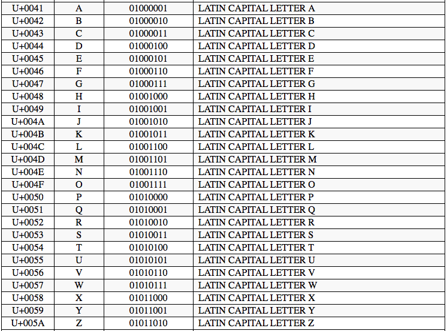
For example here is a list of UTF-8 characters with their associated binary code (www.utf8-chartable.de).

Instead of using variables, I could have saved and read data to/from temporary files throughout the execution of the program however that would make the program really inefficient and un-robust as the program would crash if the files were moved or edited.

###Lists
Lists allow me to collect multiple elements together in a single container. This allows me to easily mutate my data, creating an easy way to sort, index, count and edit the list as well as elements inside the list. It also is useful for looping through different elements to check in a for or while loop. For example:

```python
for i in numsused:
	toprint.append(words[i])
```

I used exclusively 1 dimensional lists in this program. I mainly used them to handle the multiple words to print. I used them to randomly organize the list of words as well as making it easier to print the different grids. By using lists it was easier to add, remove and change words where I needed to and a list made more sense for this than a dictionary or tuple would do as there is only 1 piece of data for each item.

I could have used multiple string variables but that would have required at least 9 different variables for each grid meaning the program would be inefficient and un-robust. I also could have used 1D arrays instead of lists however these are static structures so you need to define the type case of the element when you create it, so by using lists my program is more robust as the lists would be able to receive data of multiple typecasts.

###Robustness
Throughout my program I have added methods to make my code robust. This means that even if the user doesn't enter the right data into the program, the program will not crash and will handle the occurrence. To make my code robust I have used various techniques like while loops and try and excepts.

####If Statements
By using If statements I was allowed to check if data was the right kind or the right length, allowing me to make my code more robust by stopping errors caused by the user entering wrong types of data. For Example:

When the user entered their choice form the main menu, I could check if it was A to then run the easier grid. I used this line of code to check:
```python
if choice == "A":
```
This allowed me to stop the programming crashing due to the user entering a wrong choice.

####While Loops
To make portions of my code robust I have used while loops, mainly when the user is asked to enter data. This allows me to check if the input is relevant and correct. If so the code carries on however if the input is incorrect the program will respond with an error message and ask the user to try again. This prevents program crashes when the user enters wrong data.
For example:

```python
while wrong == True:
	askremoved = input("What word was removed?")
	if askremoved.upper() == removed:
		print("You got it right!")
		wrong = False
	else:
		attempt += 1
		#If they have had 3 attempts restart the game
		if attempt == 3:
			print("You Lost!")
			menu()
		else:
			print("Try again")
			wrong = True
```
This meant that even if the input from the user isn't a valid input the program won't crash and will ask the user to try again.

####Try And Except
Another way I made my code robust is by using try and except. Using try and except allows the program to handle any errors without crashing. For example when I used try and except in my readwords function, the code would try to read the file but if the file doesn't exist the try and except allowed the program not to crash and to produce an error message. In python the try and except functions can also have custom error handling which allows you to run different code blocks depending on what the error was. For example:

```python
try:
	f = open(FileName, "r")
	str = f.read()
	f.close()
	int(str)
except IOError as e:
 print "Could not open file."
except ValueError:
 print "Could not convert data to an integer."
```

This code is used so that if the error is related to opening the file the 1st except block will run, but if however the the error is because the string isn't convertible to an integer the 2nd except block will run. There is also the ability to add an else clause to the try and except when used like this, which allows the program to run the else block if the error doesn't match any other except blocks. 

For Example I used the try and except code block when the program imports the words, if the file doesn't exists the program doesn't crash:
```python
def readwords(level):
	#Set the path to the square root of the level + x = square root of the level + .txt. E.g. 3x3.txt
	path = str(int(math.sqrt(level))) +  "x" + str(int(math.sqrt(level))) + ".txt"
	#Set words to empty array to put the words in
	words = []
	try:
		#Opening file using with
		with open(path) as f:
			#Adding each word to the array words
			words += f.readlines()
		
		#If there arent enough words from the file show an error
		if len(words) != 10 or len(words) != 17:
			print("I'm sorry there has been an error; the word files are invalid")
			exit()

		#For each element of the array strip it from newline
		for i in range(0,len(words)):
			words[i] = words[i].rstrip()
		return words
	except:
		print("I'm sorry there has been an error; the word files are invalid")
		exit()

```

####Variables
I haven't used any global variables in my project I've only used local variables. I've only used local variables because global variables make the application more vulnerable due to the fact that multiple functions are changing and using the same variable which would lead to unexpected results and bugs. 


####External Modules
For this application I used three external modules which were the time, random and math modules. These modules allow you to use pre-written code to do specific tasks. For example the random module allows you to generate a random number. This has made my code more robust because it meant I haven't had to make my own function, meaning that there is less chance of it not being truly random. By using a module it also meant that the code will be more robust because other people have made and tested it. I used this module when randomly organizing the words and randomly picking the words to add and remove.

```python
import random
```
This code snipped is used to import the random module to use it inside my program. 


```python
random.shuffle(finalwords)
```

This code uses the random module to randomly shuffle the list of words so they have a different order.

####Inbuilt Functions
To write this program I used the language python which has hundreds of inbuilt functions, for example, input, print, sort. All of these functions are build into the language. This means that I don't need to write each function myself this is useful for a few reasons; Firstly it makes my code more efficient because I have to write less, it makes my code more robust because there is no chance of me making a mistake when writing each function, it means I don't have to write out all the functions myself and there wont be any errors. I used inbuilt functions every time I asked the user to input data or every time I printed something to the console.

For example I used the inbuilt function .Upper() to convert the inputs from the user to all Uppercase letters. This means that my program is more robust when a user enters data because it doesn't matter if they have a mix of upper and lower case, it will all get convert to the same case:

```python
var userinput = "Hello"

print(userinput)
#Will output Hello

print(userinput.upper())
#Will output "HELLO"
```
 Instead of using this inbuilt function I could have made my own dictionary with the lower and uppercase values in.

```python
lowertocaps = {"a":"A", "b":"B", "c":"C", "d"':"D", "e":"E", "f":"F"}


var userinput = "Hello"

#To convert this to upper case:
var alluppercase = ""
for i in userinput:
	x = lowertocaps[i]
	alluppercaase += x

print(alluppercase)
#Will Output HELLO
``` 

By doing this I would have full control of how the conversion between the upper and lowercase would work, however this makes it really non-robust and vulnerable because unlike the `upper()` inbuilt function my conversion method doesn't have error handling for an invalid input. I could have made a mistake when writing the dictionary which could then have problems later on in my program.


##Testing

###Tests

| No. | Function      | Description                                  | Data            | Expected Result                                                     | Pass/Fail |  
| --- | ------------- | -------------------------------------------- | ------          | -----------------------                                             | --------- |  
| 001 | Menu          | Select a menu option                         | A               | Load run function with easy level                                   | Pass      |  
| 002 | Menu          | Select a menu option                         | B               | Load hard function with easy level                                  | Pass      |  
| 003 | Menu          | Select a menu option                         | EXIT            | Exits program                                                       | Pass      |  
| 004 | Menu          | Enter an unsupported Value                   | K               | Produced an error message; Asks User to try again                   | Pass      |  
| 005 | Menu          | Enter an unsupported Value                   | 1               | Produced an error message; Asks User to try again                   | Pass      |  
| 006 | Menu          | Enter an unsupported Value                   | /               | Produced an error message; Asks User to try again                   | Pass      |  
| 007 | Menu          | Enter an unsupported Value                   | @               | Produced an error message; Asks User to try again                   | Pass      |  
| 008 | ReadWords     | With an existing file                        | -               | Open file and read text and import words                            | Pass      |  
| 009 | ReadWords     | With an invalid file                         | -               | Produces error message; program quits                               | Pass        |  
| 010 | ReadWords     | Open an existing file with no data           | -               | Produces error message; program quits                               | Pass      |  
| 011 | askquestions  | Enter the right answer                       | Right Answer    | Shows message "You got it right!" and moves on to the next question | Pass      |  
| 012 | askquestions  | Enter the wrong answer                       | Wrong Answer    | Shows message "Try again" and asks the question again               | Pass      |  
| 013 | askquestions  | Enter an unsupported Value                   | K               | Shows message "Try again!" and asks the question again              | Pass      |  
| 014 | askquestions  | Enter the wrong answer 3 times               | Wrong answer x3 | Shows message "You Lost!" and goes back to the main menu            | Pass      |  
| 015 | askquestions  | Enter yes for playing again                  | Yes             | Proceeds to play again                                              | Pass      |  
| 016 | asksquestions | Enter No for playing again                   | No              | Exits the program                                                   | Pass      |  
| 017 | asksquestions | Enter an unsupported value                   | @               | Produced error message; asks user to try again                      | Pass      |  


####Screenshots

| No. | Screenshot                                      |  
| --- | ----------------------------------------------- |  
| 001 | 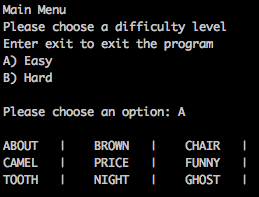   |  
| 002 | 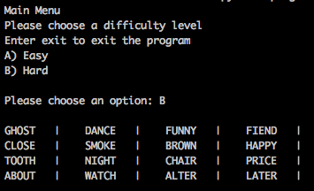   |  
| 003 | 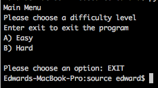   |  
| 004 | 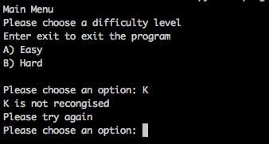   |  
| 005 | 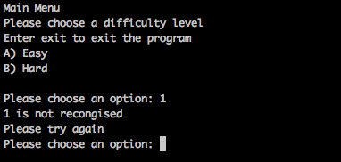   |  
| 006 | 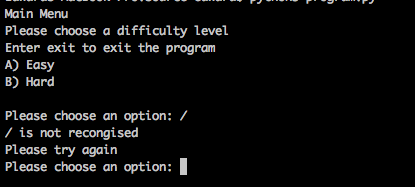   |  
| 007 | 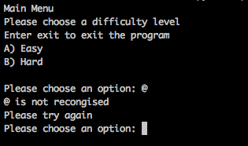   |  
| 008 | 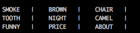   |  
| 009 | 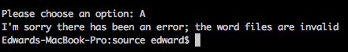   |  
| 010 | 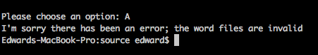   |  
| 011 | 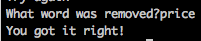   |  
| 012 | 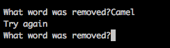   |  
| 013 | 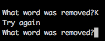   |  
| 014 | 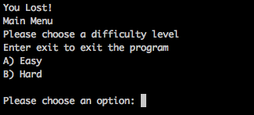   |  
| 015 | 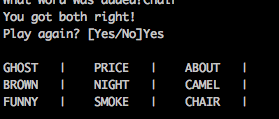   |  
| 016 | 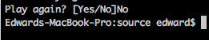   |  
| 017 | 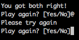   |  


##Evaluation
###Task1 - Load words
The load words function meets the user's needs because it loads the list of words without the user needing to have any input. I also added error handling so if the file wasn't there the user would see an error message and not the program crashing. Although it's not part of the brief I also made it so that if a text file with the wrong amount of words is loaded the program will still work. This builds on the user's needs as the program will not crash if there are too many words in the file. However if not enough words are in the text file the program will throw an error message and the program will stop. This is shown in this code block: 

```python
#Define read words function
def readwords(level):
	#Set the path to the square root of the level + x = square root of the level + .txt. E.g. 3x3.txt
	path = str(int(math.sqrt(level))) +  "x" + str(int(math.sqrt(level))) + ".txt"
	#Set words to empty array to put the words in
	words = []
	try:
		#Opening file using with
		with open(path) as f:
			#Adding each word to the array words
			words += f.readlines()
		
		#If there arent enough words from the file show an error
		if len(words) < level + 1:
			exit()

		#For each element of the array strip it from newline
		for i in range(0,len(words)):
			words[i] = words[i].rstrip()
		return words
	except:
		print("I'm sorry there has been an error; the word files are invalid")
		exit()
```

###Task2 - Display the 3x3
The display grid function shows the grid of 9 words to the user. This is shown in a grid as it's an easier format for the user to view. Due to the ```grabwords()``` function the order of the words is randomized before it gets displayed. I've built the function to run with any amount of words in the list give to the function. This means that I was able to use the same function to print my 3x3 grid and my 4x4 grid. This is shown working in test 2 in conjunction with task 1 and can be shown in this block of code:

```python
def printgrid(toprint, level):
	#Set the variable count to 0
	count = 0
	#For every word in the array to print
	for i in toprint:
		#If count is divisible by the square root of the level print a new line
		if count % (math.sqrt(level)) == 0:
			print("<<newline>>", end="")
		print(i, end="")
		print("   |    ", end="")
		count += 1
	print("<<newline>>")
	return
```


###Task3 - Remove the first grid and display the second grid.
This task needed me to hide the first grid after 30 seconds and then display the second grid which has been randomly arranged with the new word replacing a word from the original grid. The words are randomized in another function called ```grabwords()``` which is run before the ```printgrid()``` function. Both these tasks are done in the background without the user needing to enter or change anything. This is shown in this code clock from the run function:

```python
#Sleep for 30 or 60 seconds
if level == 16:
	time.sleep(60)
else:
	time.sleep(30)
#Clear the screen
print(chr(27) + "[2J")
#Set the variable removed to the word to remove
removed = finalwords[toremove]
#Replace the word that is to be removed
finalwords[toremove] = toadd
#Shuffle the array
random.shuffle(finalwords)
#Print the second grid
printgrid(finalwords, level)
```


###Task4 & 5 & 6 & 7 - Ask the user to enter the word that was removed
This task needed me to ask the user which word was removed from the grid. This involved asking the user for the answer, converting it to all upper case to allow for any case errors, checking if they got it right and giving the user 3 chances. By converting the user's input to all upper case I am making my program more robust. This function meets the users needs because it asks the questions in a simple, efficient manner. All of these functions are shown working in test 11, 12 and 13 and this code block:

```python
wrong = True
attempt = 0
#Start a while loop for while they don't have the right answer
while wrong == True:
		#Ask the user to enter the word that was added
		askadded = input("What word was added?")
		#Check if the word is right
		if askadded.upper() == added:
			print("You got both right!")
			wrong = False
		else:
			#Add one to the number of attempts
			attempt += 1
			if attempt == 3:
				print("You Lost!")
				menu()
			else:
				print("Try again")
				wrong = True

```


###Task 8 - Display a success message
This task just needed me to display a simple success message to the user when they have guessed the correct removed word and the substituted word. I did this by using a print statement to print the message "You got both right!". This just simply displays the message to the user. This is shown at the top of test 15 and this extract of code from the function ```askquestions()```:

```python
print("You got both right!")
```

###Task 9 - Add the option of a 'hard' level
This task needed me to produce a menu to allow the user to choose which level they would like to play. Then if the user chose the harder option (the 4x4 grid) the program would need to open a different file. I managed this by sending the total number of words to the ```run()``` function as a parameter. I then was able to manipulate this parameter later on in my program to find how many words per row needed to be printed. This option is shown in test 2 this is shown in this function ```mainmenu```:

```python

def menu():
	choice = "NULL"
	print("""Main Menu
Please choose a difficulty level
Enter exit to exit the program
A) Easy
B) Hard
""")

	while choice != "A" or choice != "B" or choice != "EXIT":
		choice = input("Please choose an option: ")
		choice = choice.upper()
		if choice == "A":
			#Run the run function with the parameter 9 (the total number of words needed)
			run(9)
		elif choice == "B":
			#Run the run function with the parameter 16 (the total number of words needed)
			run(16)	
		elif choice == "EXIT":
			exit()
		else:
			print (choice, "is not recongised")
			print ("Please try again")
			choice = "NULL"
```

